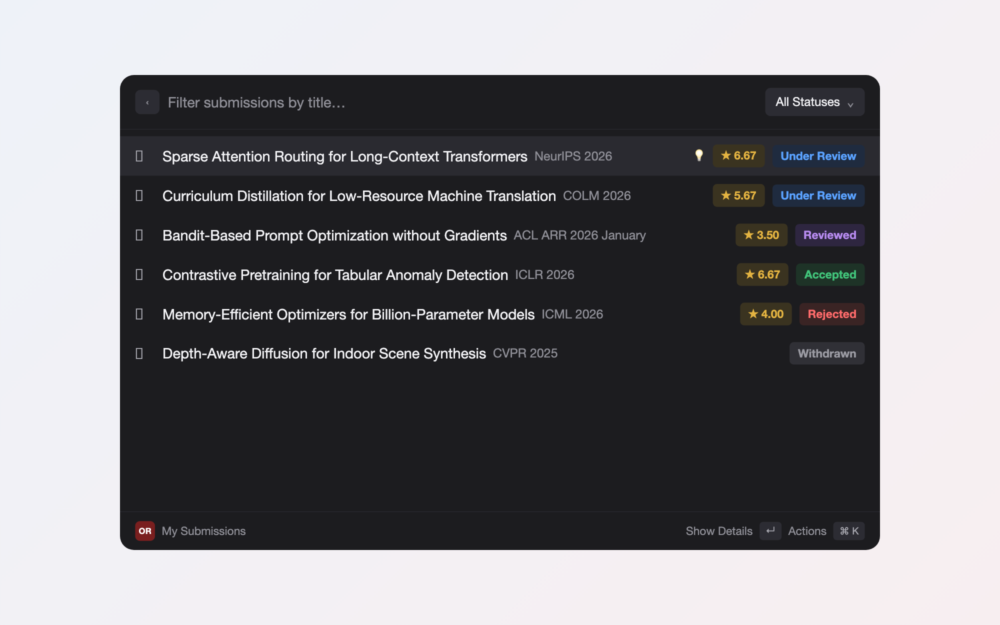
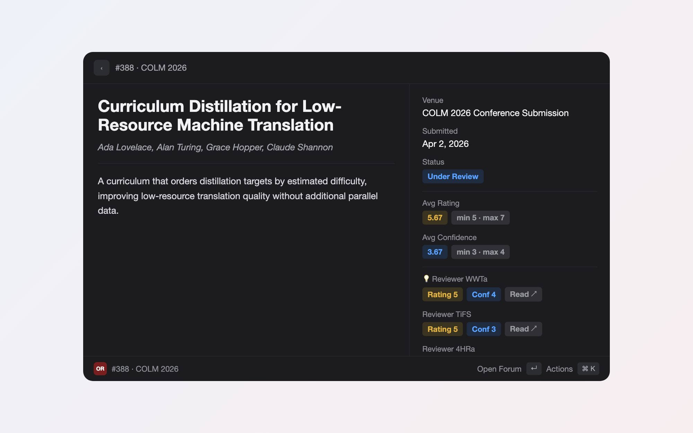

# OpenReview (Raycast Extension)

See your OpenReview submissions, review scores, and decisions across every
venue — straight from Raycast. A read-only mirror of OpenReview's Author Console.




## Command

**My Submissions** — a scannable list of every submission where you are an
author, newest first (sorted by true submission time). Press `↵` to open the
detail page.

- **List rows:** title, the short venue (e.g. `ICML 2026`) as subtitle, the
  average recommendation (★), and a color-coded **status** tag (Under Review /
  Accepted / Rejected / Withdrawn / Desk Rejected).
- **Status filter dropdown** in the top-right (`searchBarAccessory`) separates
  active submissions from past ones.
- **New-review indicator:** a 💡 lights up on any submission whose review count
  grew since you last opened it (tracked in `LocalStorage`). Opening the
  submission clears it; `⌘.` marks one as seen, `⌘⇧.` marks all.
- **Detail page (`↵`):** the body shows the title, authors, and the **abstract**.
  All structured data lives in the metadata sidebar as **colored tags** — Status,
  Decision, average score and Confidence (with min/max), and **one row per
  reviewer** (`score · confidence · Read ↗`) whose tags are clickable to open
  that review — plus Venue, Submitted date, and Forum/PDF links.
- **Per-venue score labels:** the rating field name is read from each venue's
  own reviews (`Rating`, `Overall Recommendation`, …) and shown verbatim rather
  than a hardcoded label.

`⌘R` refreshes. Search matches the submission number via keywords even though it
isn't shown in the row.

## Install locally (no Store)

Raycast (macOS) and Node 20+ required.

```bash
git clone https://github.com/oishikimchi97/openreview-raycast.git
cd openreview-raycast
npm install
npm run dev
```

`npm run dev` builds the extension and **imports it into Raycast** — it then
stays in your Raycast extension list even after you stop the dev process
(`Ctrl-C`). Alternatively, open Raycast → search **"Import Extension"** → select
this folder.

Then:

1. In Raycast, open the **OpenReview** extension's preferences (`⌘,` on it) and set:
   - **OpenReview Email** — the email you log in to OpenReview with.
   - **OpenReview Password** — stored securely in Raycast (macOS Keychain), only
     used to fetch a session token.
2. Run the **My Submissions** command.

To pick up later changes, run `git pull` and `npm run dev` again. `npm run build`
produces a production build without importing.

## Authentication & security

**Why email + password (and not an API key/token)?** OpenReview offers **no API
keys, personal access tokens, or OAuth** for third-party apps. The *only* way to
authenticate is `POST /login` with your username/password, which returns a
short-lived **JWT** (default 1 hour, max **1 week** via `expiresIn`). There is no
permanent token to paste instead — any token must be obtained by logging in, and
it expires within a week.

Given that constraint, storing the password is the standard approach (the
official `openreview-py` client reads `OPENREVIEW_USERNAME` / `OPENREVIEW_PASSWORD`
the same way). It is reasonably safe here because:

- The **password** preference is `type: "password"`, so Raycast keeps it in its
  **local encrypted database / macOS Keychain**, never in plaintext, and only
  this extension can read it — see [Raycast Security](https://developers.raycast.com/information/security).
- The password is used **only on (re)login** — roughly **once a week**. Day to
  day, only the cached 1-week JWT token (in `LocalStorage`) is sent to the API;
  the token auto-refreshes when it expires.

A token-only mode (paste a JWT, never store the password) would be marginally
more secure but breaks every ≤1 week and requires manual re-entry, so it was
deliberately not adopted. See the design spec §4 for the full rationale.

## How it works

- Authenticates against the OpenReview API v2 (`https://api2.openreview.net`)
  with your email/password as described above, caching the session token (up to
  1 week) in Raycast `LocalStorage` so you rarely re-login.
- Finds your submissions via `GET /notes?content.authorids=<your profile>`
  with `details=directReplies`, so each submission's reviews and decision come
  back in one request.
- Review score fields vary per venue, so they are matched heuristically
  (`Overall_recommendation`, `rating`, `recommendation`, `score`, `confidence`).
  Missing fields render as `N/A`.

## Scripts

| Script | What it does |
|--------|--------------|
| `npm run dev` | Run in Raycast (hot reload) |
| `npm run build` | Production build (`ray build -e dist`) |
| `npm run lint` / `npm run fix-lint` | ESLint + Prettier |
| `npm test` | Unit tests for the parsing/aggregation logic (`vitest`) |

## Development notes

- `src/lib/parse.ts` is pure and dependency-free (no `@raycast/api` import), so
  the parsing/aggregation logic is unit-tested against captured OpenReview JSON
  in `src/lib/parse.test.ts` without any network or Raycast runtime.
- Design spec: `docs/specs/2026-06-04-openreview-raycast-design.md`.
  Implementation plan: `docs/superpowers/plans/2026-06-04-openreview-raycast.md`.
- `assets/icon.png` is generated by `node scripts/gen-icon.mjs`.

## Out of scope (for now)

Drafting/posting rebuttals, posting comments, and new-review notifications are
intentionally deferred; each can be added later as its own command.
